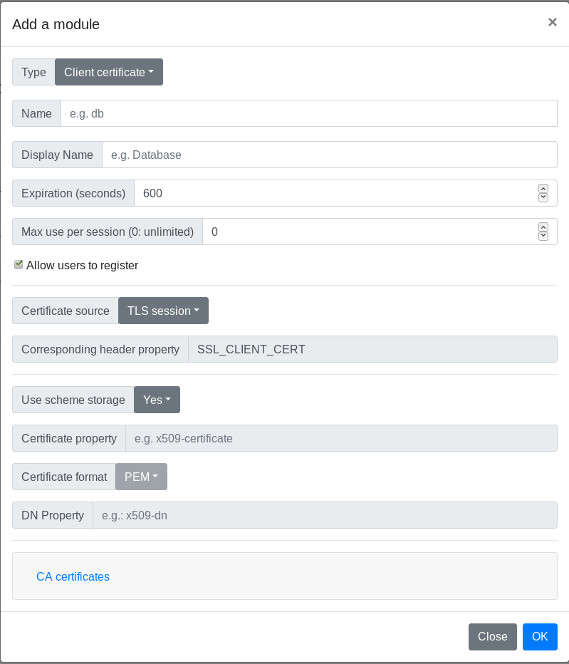

# Glewlwyd TLS Certificate Schema documentation

The TLS Certificate Schema implements authentication based on the [Client-authenticated TLS handshake](https://en.wikipedia.org/wiki/Transport_Layer_Security#Client-authenticated_TLS_handshake) protocol.

!!!Full disclosure!!!
This authentication scheme has been implemented based on the documentation and examples I could find. But there may be other and better ways to implement this type of authentication.
If you find bugs, weird behaviours, or wish new features, please [open an issue](https://github.com/babelouest/glewlwyd/issues) in the GitHub repository or send an e-mail.

## Installation

In the administration page, go to `Parameters/Authentication schemes` and add a new scheme by clicking on the `+` button. In the modal, enter a name and a display name (the name must be unique among all authentication scheme instances), and a scheme session expiration in seconds.
Select the type `Client certificate` in the Type drop-down button.

Below is the definition of all parameters.

### Name

Name (identifier) of the scheme, must be unique among all the scheme instances, even of a different type.

### Display name

Name of the instance displayed to the user.

### Expiration (seconds)

Number of seconds to expire a valid session.

### Max use per session (0: unlimited)

Maximum number of times a valid authentication with this scheme is possible. This is an additional parameter used to enforce the security of the session and forbid to reuse this session for other authentications.

### Allow users to register

If this option is unchecked, only administrator can register this scheme for every user via the administration page.

### Certificate source

Source of the client certificate to be picked by the scheme. Either in the TLS session, the HTTP header or both.

If you intent to use Glewlwyd directly, set this option to `TLS Session`. You must also configure Glewlwyd in secure mode with the proper `secure_connection_ca_file` value. This configuration value must be set to your CA certificate or your CA chain certificate in order to validate clients certificates provided.

Important security warning!
If you don't use Glewlwyd behind a reverse proxy to forward the certificate in the header, this option MUST be set to `TLS Session` only, otherwise, an attacker could manually change the header value, to fake any valid user without having to know its certificate key.

If you set this value to `HTTP Header` or `both`, it allows to use Glewlwyd behind a reverse proxy such as Apache's mod `proxy`. You must then configure the proxy to validate the clients certificate and key using your CA certificate and if the client certificate is valid, the proxy must forward the X509 certificate to Glewlwyd in a specified header.

### Corresponding header property

This option will store tame of the header property that will contain the client certificate in PEM format without newlines.
Using the example config above, you must set this value to `SSL_CLIENT_CERT`.

### Use scheme storage

If this option is set to `yes`, the registered certificates will be stored in the database, in a specific table for this scheme.

If this option is set to `no`, the registered certificates will be extracted from the user properties. Also, at least one of the fields `Certificate property` or `DN Property` must be filled. If a user has a DN value and one or more certificates in its properties, only the DN will be checked to validate its certificate.

### Certificate property

This option is available if the option `Use scheme storage` is set to `no`. It is used to specify the user property that will store the certificates used to authenticate the user.

### Certificate format

This option is available if the option `Use scheme storage` is set to `no`. This is used to specify the certificate format stored in the user properties: `PEM` or `DER`.

Because Glewlwyd's internal format of the user properties is JSON, if the certificate format is set to `DER`, the certificate must be converted to base64. In fact, this option exists to use the LDAP property `userCertificate` which is stored in DER format. In that case, the property `userCertificate` must be converted in base64 in the [LDAP backend configuration](USER_LDAP.md#convert).

### DN Property

This option is available if the option `Use scheme storage` is set to `no`. It is used to specify the user property that will store the user DN to authenticate the certificate.

### CA Certificates

This section was designed to validate the client certificate using the full chain of trust until the root CA.

### Use a CA

If this option is set to `yes`, the admin will be allowed to add the CA chain files to validate each user certificates.

Then, the admin can add one or multiple files by clicking `Browse`, select the file, then click `Upload`.
