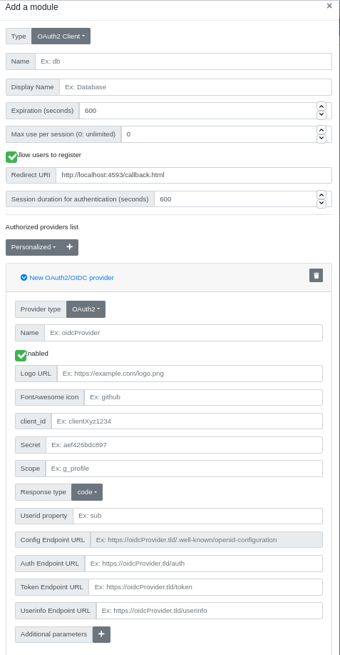

# Glewlwyd OAuth2 Schema documentation

The OAuth2 Schema implements authentication based on authentication via external OAuth2/OIDC services. The chain of trust is based on the Glewlwyd's administrator trusting the OAuth2/OIDC service to authenticate Glewlwyd's users. Therefore Glewlwyd's administrator must enter only trustable external providers. It is strongly suggested to test the providers authentication with your configuration before telling your users to do so.

## Installation

In the administration page, go to `Parameters/Authentication schemes` and add a new scheme by clicking on the `+` button. In the modal, enter a name and a display name (the name must be unique among all authentication scheme instances), and a scheme session expiration in seconds.
Select the type `OAuth2` in the Type drop-down button.

Below is the definition of all parameters.

### Name

Name (identifier) of the scheme, must be unique among all the scheme instances, even of a different type.

### Display name

Name of the instance displayed to the user.

### Expiration (seconds)

Number of seconds to expire a valid session.

### Max use per session (0: unlimited)

Maximum number of times a valid authentication with this scheme is possible. This is an additional parameter used to enforce the security of the session and forbid to reuse this session for other authentications.

### Allow users to register

If this option is unchecked, only administrator can register this scheme for every user via the administration page.

### Redirect URI

Callback URI that will be used in the OAuth2/OIDC flow. This option is filled by default with what is supposed to be the expected redirect URI: https://<glewlwyd_url>/callback.html. If you know what you do, you can change this value.

### Session duration for authentication (seconds)

Duration of the session for users to authenticate in the external provider, i.e. the maximum time they can spend between their click on the `login with` button and when they get redirected to `callback.html` with a valid authentication.

### Authorized providers list

Providers used for external authentication in Glewlwyd. The administrator can add a `mainstream` provider or a personalized provider. If you choose a mainstream providers, some settings will be filled but you must fill at least `client_id` and `client_secret` (if necessary) with your own. You can choose a mainstream provider and then change its settings if you need. The mainstream provider list is here to facilitate the administrator's job but its settings may be obsolete or not fitted to your needs. `mainstream` provider settings are configurable in the `config.json` file.
By default, Glewlwyd comes with a list of `mainstream` providers such as Google, Facebook or Microsoft. If you think another `mainstream` provider should be present on this list, feel free to send a pull request.

Below is the list of settings for a provider.

### Provider Type

Type of the provider. Supported types are OAuth2 or OIDC (OpenID Connect).

### Name

Name of the provider. Must be unique among the provider list. This value is mandatory.

### Logo URL

URI of the provider logo, this will be used as a graphical identity in the profile or login page. The logo must be an small image (maximum 50x50).

The Logo URI has the highest priority. If you have both Logo URI and Logo Font-Awesome for a provider, the Logo URI will be used in the Profile or Login page.

### Fork Awesome icon

Name of the [Fork Awesome](https://forkaweso.me/Fork-Awesome/) icon to be used as a graphical identity in the profile or login page. Glewlwyd uses Fork Awesome 1.1.7.
For example, if you want to add the [following icon](https://forkaweso.me/Fork-Awesome/icon/debian/) to your provider, you must enter the `fa-*` value specified in the HTML tag:

`<i class="fa fa-debian"></i>` => the logo value must be `fa fa-debian`.

The Logo URI has the highest priority. If you have both Logo URI and Logo Fork Awesome for a provider, the Logo URI will be used in the Profile or Login page.

### client_id

Client identifier as given by the provider. This value is mandatory.

### Secret

Client secret (password) given by the provider. This value is mandatory or optional depending on your provider's policy.

### Scope

Scope to use with the provider authentication flow. This value is mandatory or optional depending on your provider's policy. If the provider type is OIDC, the scope value will be set to `openid`.

### Response Type

OAuth2 response type to use for the authentication flow. Response types supported are `code` (OAuth2/OIDC provider type), `token` (OAuth2 provider type) or `id_token` (OIDC provider type).

### Userid property

This is the name of the property that will contain the user identifier necessary to identify it during the authentication flow.

### Config Endpoint URL

URL of the provider's [OIDC config endpoint](https://openid.net/specs/openid-connect-discovery-1_0.html), i.e. https://provider.tld/.well-known/openid-configuration. This setting is available for OIDC providers only.

### Auth Endpoint URL

URL of the provider's auth endpoint. This setting is mandatory if the setting `Config Endpoint` is not set.

### Token Endpoint URL

URL of the provider's token endpoint. This setting is mandatory if the setting `Config Endpoint` is not set and the response type used is `code`.

### Userinfo Endpoint URL

URL of the provider's endpoint to fetch the user's information. This setting is mandatory of the provider type is OAuth2.

### Additional parameters

Additional parameters to pass to the auth endpoint query string
