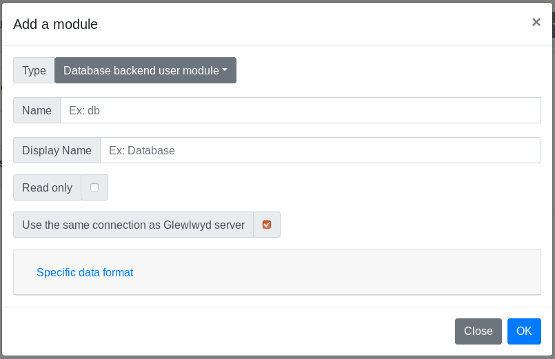

# Glewlwyd User Module Database Backend documentation

The database backend uses a database to store information and passwords for users. The database can be the same one as the Glewlwyd database or another database of another supported type.

## Installation

In the administration page, go to `Parameters/Users data sources` and add a new user module by clicking on the `+` button. In the modal, enter a name and a display name (the name must be unique among all user backend instances).
Select the type `Database backend user module` in the Type drop-down button.

Below is the definition of all parameters.

### Name

Name (identifier) of the module instance, must be unique among all the user backend module instances, even of a different type.

### Display name

Name of the instance displayed to the user.

### Read only

Check this option if you want to use this backend as read-only. All user properties such as e-mail, name, password, scopes can't be modifier with Glewlwyd, even administrators.

### Use the same connection as Glewlwyd server

Uncheck this option if you want to use a different database that will store the users. The new database must have the structure already present. Use one of the following script to initialize the database:

- MariaDB: [database.mariadb.sql](../src/user/database.mariadb.sql)
- Postgre SQL: [database.postgre.sql](../src/user/database.postgre.sql)
- SQLite 3: [database.sqlite3.sql](../src/user/database.sqlite3.sql)

### Database type

This option is available if the option `Use the same connection as Glewlwyd server` is disabled.
Select the database backend among the ones available.

### Path to the database (SQLite 3)

This option is available if the database type selected is SQLite 3.
Enter the path of the SQLite 3 database on the server.

### Host (MariaDB/MySQL)

This option is available if the database type selected is MariaDB/MySQL.
Hostname of the MariaDB/MySQL server.

### Username (MariaDB/MySQL)

This option is available if the database type selected is MariaDB/MySQL.
Username to connect to the MariaDB/MySQL server.

### Password (MariaDB/MySQL)

This option is available if the database type selected is MariaDB/MySQL.
Password to connect to the MariaDB/MySQL server.

### Database name (MariaDB/MySQL)

This option is available if the database type selected is MariaDB/MySQL.
Name of the database hosting the Glewlwyd user backend tables.

### TCP Connection port (0: system default) (MariaDB/MySQL)

This option is available if the database type selected is MariaDB/MySQL.
TCP Port used to connect to the MariaDB/MySQL database. Set 0 if you want to use default system port.

### Postgre SQL connection string (PostgreSQL)

This option is available if the database type selected is PostgreSQL.
SQL Connection string used to connect to the PostgreSQL database.

### Specific data format

This section allows to specify new properties for the user. The properties may be available for schemes, plugins, in the admin page or in the profile page.

#### Property

Property name, ex: `phone`, `address`, `human`, etc.

#### Multiple values

If this option is checked, the property values will be available as an array of string values, otherwise a single string value.

#### Read (admin)

If this option is checked, plugins, schemes and administrators can have access to this property in read mode.

#### Write (admin)

If this option is checked, plugins, schemes and administrators can have access to this property in write mode.

#### Read (profile)

If this option is checked, the user can have access to this property in read mode in its profile API.

#### Write (profile)

If this option is checked, the user can have access to this property in write mode in its profile API.
